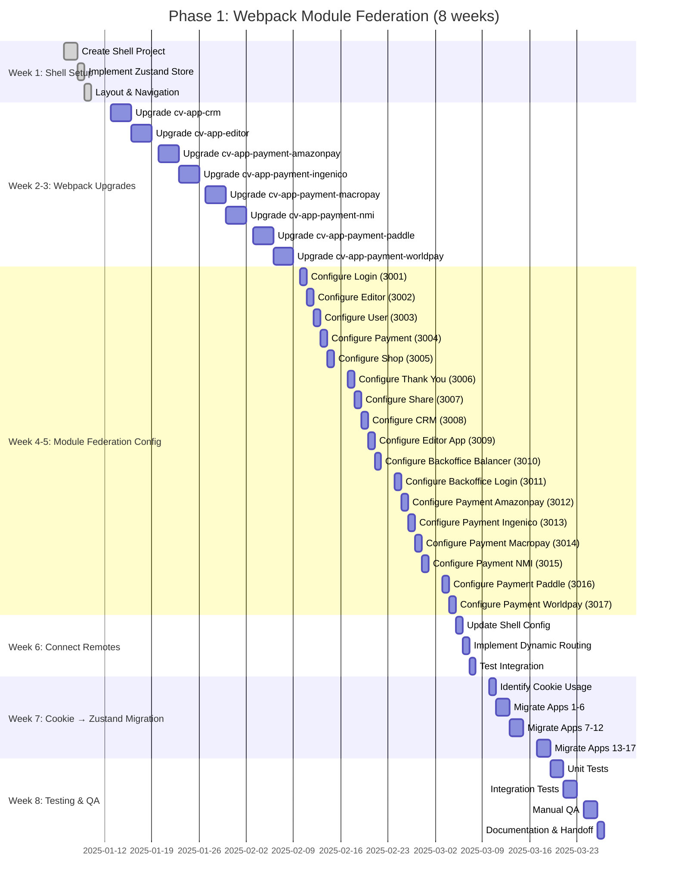
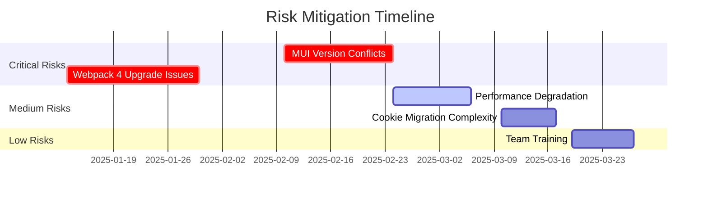

# Phase 1 Timeline - Webpack Module Federation

## 📅 Gantt Chart



## 📊 Progress Tracker

### Week 1: Shell Setup ✅
- [x] Task 1.1: Create Shell Project (2 days)
- [x] Task 1.2: Implement Zustand Store (1 day)
- [x] Task 1.3: Layout & Navigation (1 day)
- **Status:** ✅ **COMPLETED** - Shell running on localhost:3000

### Week 2-3: Webpack 4 → 5 Upgrades 🔄
- [ ] cv-app-crm (3 days)
- [ ] cv-app-editor (3 days)
- [ ] cv-app-payment-amazonpay-3ds (3 days)
- [ ] cv-app-payment-ingenico (3 days)
- [ ] cv-app-payment-macropay (3 days)
- [ ] cv-app-payment-nmi (3 days)
- [ ] cv-app-payment-paddle (3 days)
- [ ] cv-app-payment-worldpay (3 days)
- **Status:** ⏳ **PENDING**

### Week 4-5: Module Federation Configuration ⏸️
- [ ] Configure all 17 apps as remotes
- [ ] Assign ports 3001-3017
- [ ] Test remoteEntry.js generation
- **Status:** ⏸️ **NOT STARTED**

### Week 6: Connect Remotes ⏸️
- [ ] Update shell webpack.config.js
- [ ] Implement lazy loading
- [ ] Test all remotes load
- **Status:** ⏸️ **NOT STARTED**

### Week 7: Cookie Migration ⏸️
- [ ] Audit cookie usage
- [ ] Migrate to Zustand
- [ ] Remove cookie dependencies
- **Status:** ⏸️ **NOT STARTED**

### Week 8: Testing & QA ⏸️
- [ ] Unit tests pass
- [ ] Integration tests pass
- [ ] Manual QA approved
- [ ] Documentation complete
- **Status:** ⏸️ **NOT STARTED**

---

## 🎯 Milestones

| Milestone | Target Date | Status |
|-----------|-------------|--------|
| **M1:** Shell Running | Week 1 | ✅ DONE |
| **M2:** All Apps on Webpack 5 | Week 3 | ⏳ In Progress |
| **M3:** Module Federation Working | Week 5 | ⏸️ Pending |
| **M4:** Remotes Connected | Week 6 | ⏸️ Pending |
| **M5:** Cookies Eliminated | Week 7 | ⏸️ Pending |
| **M6:** Phase 1 Complete | Week 8 | ⏸️ Pending |

---

## 📈 Burn-down Chart

```
Tasks Remaining vs Weeks

100 |█████████████████████████
 90 |███████████████████████
 80 |█████████████████████      ← Week 3 target
 70 |███████████████████
 60 |█████████████████
 50 |███████████████            ← Week 5 target
 40 |█████████████
 30 |███████████
 20 |█████████                  ← Week 7 target
 10 |█████
  0 |█                          ← Week 8 complete
    +---------------------------
     1  2  3  4  5  6  7  8 (weeks)

Current: Week 1 Complete (12.5% done)
```

---

## 🚦 Risk Timeline



---

## 🔄 Alternative Formats

### For GitHub Issues/Projects
Copy the checklist above and paste directly into GitHub Issues.

### For Notion/Trello
Export as CSV:
```csv
Task,Week,Duration,Status,Owner
Create Shell,1,2d,Done,Team
Zustand Store,1,1d,Done,Team
Layout & Nav,1,1d,Done,Team
Upgrade CRM,2,3d,Pending,TBD
...
```

### For Jira
Import as Epic with subtasks using the checklist format.

### For Google Sheets
Create columns: Task | Week | Duration | Status | Owner | Notes

---

## 📱 Mobile View (Text-based)

```
PHASE 1 TIMELINE
════════════════

Week 1 [██████████] 100% ✅
  - Shell Setup Complete

Week 2-3 [          ] 0% ⏳
  - Webpack Upgrades

Week 4-5 [          ] 0%
  - Module Federation

Week 6 [          ] 0%
  - Connect Remotes

Week 7 [          ] 0%
  - Cookie Migration

Week 8 [          ] 0%
  - Testing & QA

Overall: [█         ] 12.5%
```

---

## 🎨 How to View Mermaid Diagrams

### GitHub
The Mermaid diagrams will render automatically when you view this file on GitHub.

### VS Code
Install the **Mermaid Preview** extension.

### Online
Paste the Mermaid code into https://mermaid.live/

### Export to Image
Use Mermaid CLI:
```bash
npm install -g @mermaid-js/mermaid-cli
mmdc -i PHASE1-TIMELINE.md -o timeline.png
```

---

**Last Updated:** 2025-01-10  
**Next Review:** Weekly on Mondays  
**Version:** 1.0.0
